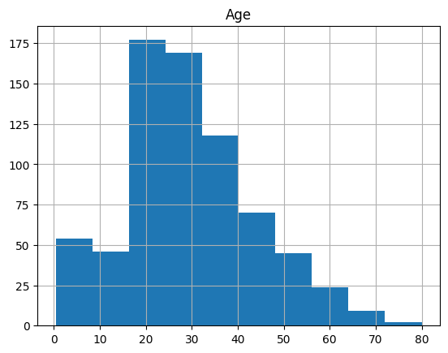
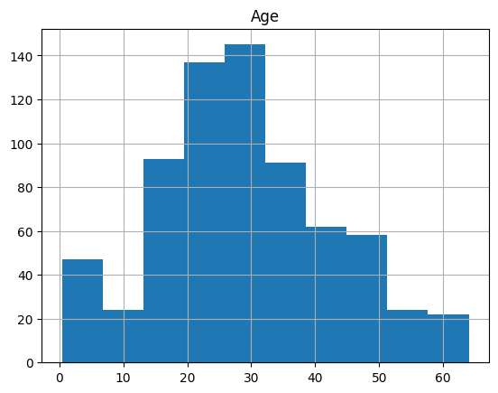

Antonie Aureliu Valentin 314CB
La inceput:
- importam bibliotecile necesare
- deschidem fisierele de train si test

Cerinta 1:
- ne folosim de functia "quantile" pentru a calcula Q1 si Q3
- IQR = Q3 - Q1
- calculam capetele intervalului a si b
* a = Q1 - 1.5 * IQR
* b = Q3 + 1.5 * IQR
- apoi, eliminam valorile din afara intervalului
- dataset-ul modificat va fi 'train1.csv'

Cerinta2: 
- calculam media
- calculam deviatia standard
- z = (x - μ) / σ,
- z_score = (val - medie) / deviatie standard
- eliminam toate valorile care au mod(z_score) > 3 
- dataset-ul modificat va fi 'train2.csv'

Cerinta3:
- eliminarea outline-urilor este importanta deoarece:
* imbunatateste acuratetea si minimizeaza log_loss
* poate detecta erori in setul de date

Cerinta4:
- la inceput vrem sa inlaturam valorile lipsa:
* pentru coloanele numerice, Nan va fi inlocuit cu media
* pentru coloanele nonnumerice, Nan va fi inlocuit cu cea mai frecventa valoare
- apoi, vrem sa convertim coloanele categorice in numerice
* vom polosi pd.get_dummies
- pentru a normaliza, vom imparti fiecare valoarea la max de pe coloana respectiva
- ca si algoritm, am ales DecisionTree
- pentru a putea antrena model-ul, intre x_train si x_test vom lua doar coloanele comune
* vom folosi pentru antrenare: model.fit(x_train,y_train)
- vom calcula y_pred = model.predict(x_test)
- apoi, vom calcula acuratetea si loss-ul folosind:
* accuracy = accuracy_score(y_test, y_pred) ~ 0.8
* loss = log_loss(y_test, y_pred) ~ 7

