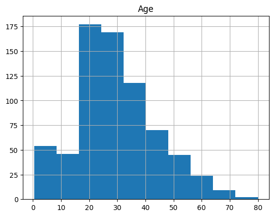
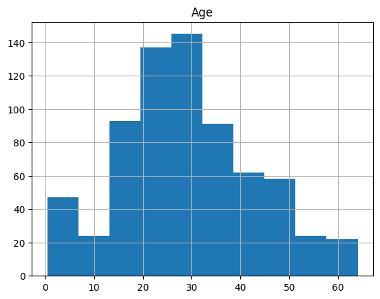

# Titanic Outlier Cleaning & Classification

This project covers the second part of a Titanic dataset analysis. The focus is on cleaning the data, removing possible outliers, checking how the distributions change after preprocessing, and training a simple classification model for survival prediction.

## Project Goal

The Titanic dataset contains passenger information such as age, sex, ticket class, fare, embarked port, and survival status. Since real datasets often include missing values and unusual observations, this project first cleans the data before using it for classification.

Only Part II of the assignment is covered here.

## Outlier Detection

Two methods were used to identify and remove extreme values:

### Interquartile Range

The IQR method marks a value as an outlier if it falls outside this interval:

```text id="h6kem1"
Q1 - 1.5 * IQR, Q3 + 1.5 * IQR
```

where `Q1` is the first quartile, `Q3` is the third quartile, and `IQR = Q3 - Q1`.

This method is useful because it does not depend strongly on the mean, so it works well when the data is not perfectly normally distributed.

### Z-score

The Z-score method measures how far a value is from the mean in standard deviations. Values with an absolute Z-score above a chosen threshold, usually 3 or 4, are treated as possible outliers.

Using both methods gives a more reliable cleaning process, because the dataset is checked from two different perspectives.

## Distribution Check

Before and after cleaning, the age distribution was compared using histograms.

Original age distribution:



Age distribution after cleaning:



The second histogram shows a cleaner distribution, with fewer extreme values. This helps reduce noise before training the model, while still keeping the main structure of the dataset.

## Preprocessing

Before training the model, the dataset was prepared using a few standard steps:

* missing numerical values were filled using representative values such as the mean;
* categorical columns like `Sex` and `Embarked` were converted to numerical values;
* numerical features were normalized;
* the dataset was split into 80% training data and 20% validation data.

## Classification Model

After cleaning and preprocessing, a classification model was trained to predict passenger survival. A model such as Decision Tree or Random Forest fits this task well because it can work with both numerical and encoded categorical features.

The model was evaluated on the validation set using metrics such as accuracy and loss. The goal was not only to get a good score, but also to check whether removing outliers made the dataset more stable and easier to use for prediction.

## Notes

The main idea of this project is simple: clean the Titanic dataset carefully, validate the result visually, and then use the cleaned data for survival prediction. The histograms are useful because they make the effect of the cleaning step easy to see instead of relying only on numbers.
